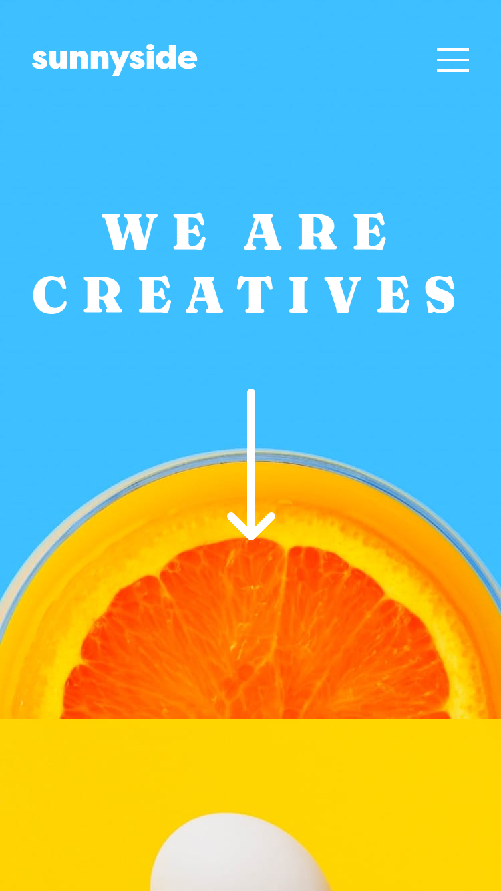

# Frontend Mentor - Huddle landing page with curved sections solution

This is a solution to the [Huddle landing page with curved sections challenge on Frontend Mentor](https://www.frontendmentor.io/challenges/huddle-landing-page-with-curved-sections-5ca5ecd01e82137ec91a50f2). Frontend Mentor challenges help you improve your coding skills by building realistic projects. 

## Table of contents

- [Overview](#overview)
  - [The challenge](#the-challenge)
  - [Screenshot](#screenshot)
  - [Links](#links)
- [My process](#my-process)
  - [Built with](#built-with)
- [Author](#author)

## Overview

### Screenshot

### Links
huddle-landing-page-with-curved-sections-master
- Solution URL: [GitHub repo](https://github.com/mathieuc22/huddle-landing-page-with-curved-sections-master)
- Live Site URL: [GitHub Pages](https://mathieuc22.github.io/huddle-landing-page-with-curved-sections-master/)

## My process

### Built with

- Semantic HTML5 markup
- [Google font](https://fonts.googleapis.com) - For fonts
- [Tailwind CSS](https://tailwindcss.com/) - For CSS framework

## Author

- Frontend Mentor - [Nervous Buffalo](https://www.frontendmentor.io/profile/mathieuc22)