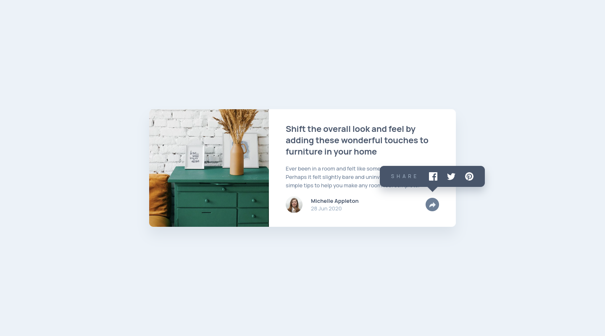
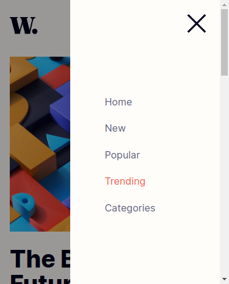

# Frontend Mentor - Single price grid component solution

This is a solution to the [Single price grid component challenge on Frontend Mentor](https://www.frontendmentor.io/challenges/single-price-grid-component-5ce41129d0ff452fec5abbbc). Frontend Mentor challenges help you improve your coding skills by building realistic projects. 

## Table of contents

- [Overview](#overview)
  - [The challenge](#the-challenge)
  - [Screenshot](#screenshot)
  - [Links](#links)
- [My process](#my-process)
  - [Built with](#built-with)
- [Author](#author)

## Overview

### The challenge

Users should be able to:

- View the optimal layout for the component depending on their device's screen size
- See a hover state on desktop for the Sign Up call-to-action

### Screenshot

<!-- 

 -->

### Links

- Solution URL: [GitHub repo](https://github.com/mathieuc22/single-price-grid-component-master)
- Live Site URL: [GitHub Pages](https://mathieuc22.github.io/single-price-grid-component-master/)

## My process

### Built with

- Semantic HTML5 markup
- Sass and CSS custom properties
- Flexbox
- [Google font](https://fonts.googleapis.com) - For fonts

## Author

- Frontend Mentor - [Nervous Buffalo](https://www.frontendmentor.io/profile/mathieuc22)