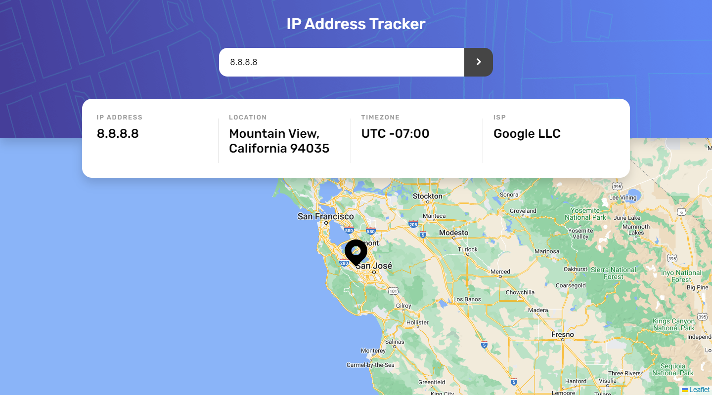
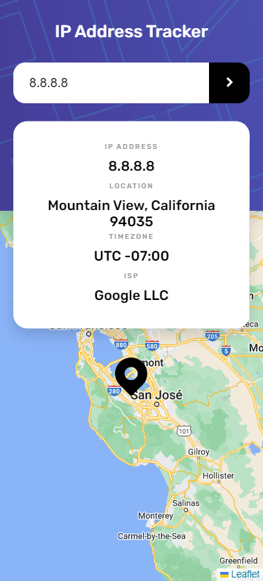

# Frontend Mentor - IP address tracker solution

This is a solution to the [IP address tracker challenge on Frontend Mentor](https://www.frontendmentor.io/challenges/ip-address-tracker-I8-0yYAH0). Frontend Mentor challenges help you improve your coding skills by building realistic projects. 

## Table of contents

- [Overview](#overview)
  - [The challenge](#the-challenge)
  - [Screenshot](#screenshot)
  - [Links](#links)
- [My process](#my-process)
  - [Built with](#built-with)
- [Author](#author)

## Overview

### The challenge

Users should be able to:

- View the optimal layout for each page depending on their device's screen size
- See hover states for all interactive elements on the page
- See their own IP address on the map on the initial page load
- Search for any IP addresses or domains and see the key information and location

### Screenshot

### Links

- Solution URL: [GitHub repo](https://github.com/mathieuc22/ip-address-tracker-master)
- Live Site URL: [GitHub Pages](https://mathieuc22.github.io/ip-address-tracker-master/)

## My process

### Built with

- Semantic HTML5 markup
- Sass and CSS custom properties
- Flexbox
- [IP Geolocation API](https://geo.ipify.org/) - For IP Geolocation
- [Alpine.js](https://alpinejs.dev/) - JavaScript framework
- [Leaflet ](https://leafletjs.com/) - For interactive maps
- [Google font](https://fonts.googleapis.com) - For fonts

## Author

- Frontend Mentor - [Nervous Buffalo](https://www.frontendmentor.io/profile/mathieuc22)
